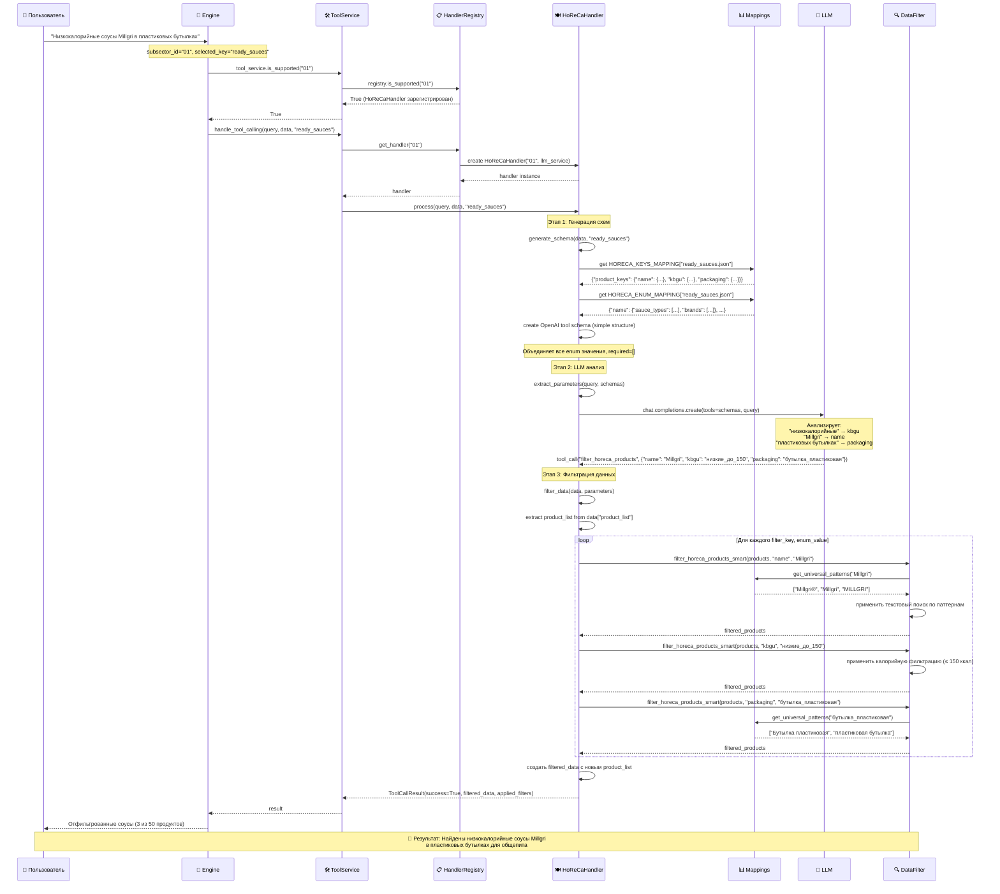

# Tool Calling Workflow для отрасли HoReCa

## Введение

Этот документ описывает полный цикл работы системы Tool Calling для отрасли HoReCa (Hotels, Restaurants, Cafés - subsector_id="01"). Workflow представляет собой интеллектуальную систему фильтрации продуктов, которая использует LLM для понимания критериев пользователя и применения их к структурированным данным индустрии общественного питания.

## Контекст и предпосылки

**Что происходило до Tool Calling:**
1. Пользователь отправил запрос с `subsector_id="01"` (отрасль HoReCa)
2. Система определила релевантный JSON файл через семантический поиск
3. Выбран конкретный ключ данных (`selected_key`) - например, `"ready_sauces"` для готовых соусов
4. Данные загружены и готовы к обработке

**Пример исходного запроса:** 
*"Покажи мне низкокалорийные соусы Millgri в пластиковых бутылках"*

## Полный пайплайн Tool Calling

### 🔍 Этап 1: Инициализация и проверка поддержки

**Код:** `engine.py:255`
```python
tool_service = ToolService(llm_service=client)
if tool_service.is_supported("01"):  # Проверяем отрасль HoReCa
```

**Что происходит:**
- `ToolService` обращается к `HandlerRegistry` для проверки поддержки
- В реестре находится зарегистрированный `HoReCaHandler` для subsector_id="01"
- ✅ Подтверждается: Tool Calling поддерживается для отрасли HoReCa

**Условия успеха:**
- HoReCaHandler зарегистрирован в registry
- LLM сервис доступен
- Переданы корректные данные

### 🏗️ Этап 2: Создание отраслевого обработчика

**Код:** `service.py:78`
```python
handler = self.registry.get_handler("01")  # Получаем HoReCaHandler
```

**Детали инициализации:**
- Создается экземпляр `HoReCaHandler("01", llm_service=client)`
- Инициализируется специализированный logger для HoReCa
- Загружаются mappings для структуры данных отрасли общественного питания

### 🛠️ Этап 3: Генерация динамических tool схем

**Код:** `horeca/service.py:69`
```python
schemas = handler.generate_schema(data, "ready_sauces")  # Генерируем схемы для готовых соусов
```

#### 3.1 Определение файла и структуры

**Процесс:**
1. `selected_key="ready_sauces"` → определяется файл `"ready_sauces.json"`
2. Прямое соответствие: `file_name = f"{selected_key}.json"`
3. Загружаются mappings структуры данных:

```python
# Из horeca/mappings/keys.py
file_keys = HORECA_KEYS_MAPPING["ready_sauces.json"]
# Получаем описания полей:
{
    "product_keys": {
        "name": {"description": "Название готового соуса", "filter_impact": "..."},
        "kbgu": {"description": "Калорийность и пищевая ценность", "filter_impact": "..."},
        "packaging": {"description": "Упаковка готовых соусов", "filter_impact": "..."},
        "shelf_life": {"description": "Условия хранения", "filter_impact": "..."}
    }
}
```

#### 3.2 Загрузка enum значений

**Структура HoReCa enum mapping:**
```python
# Из horeca/mappings/enums.py
file_enums = HORECA_ENUM_MAPPING["ready_sauces.json"]

# Для ready_sauces.json структура:
"ready_sauces.json": {
    "name": {
        "sauce_types": ["горчичный", "барбекю", "сырный", "майонезный", "кетчуп"],
        "brands": ["Millgri", "КЛАССИКА", "Heinz"]
    },
    "kbgu": {
        "calorie_ranges": ["низкие_до_150", "средние_150_250", "высокие_250_400"],
        "fat_content": ["обезжиренные", "низкожирные_до_15", "средне_жирные_15_30"]
    },
    "packaging": {
        "package_types": ["бутылка_пластиковая", "bag_in_box", "блистер", "дойпак"],
        "volumes": ["малый_до_0.5л", "средний_0.5_1л", "большой_свыше_1л"]
    },
    "shelf_life": {
        "storage_conditions": ["при_комнатной_температуре", "в_холодильнике", "замороженный"],
        "duration_ranges": ["короткий_до_6мес", "средний_6_12мес", "длительный_свыше_12мес"]
    }
}
```

#### 3.3 Создание OpenAI tool схемы

**Особенность HoReCa - простая структура без субключей:**
- Все enum значения объединяются для каждого поля
- Стандартные типы: `"type": "string"`
- Все поля опциональны: `"required": []`

```json
{
    "type": "function",
    "function": {
        "name": "filter_horeca_products",
        "description": "Фильтрует продукты HoReCa из файла ready_sauces.json по заданным критериям.",
        "parameters": {
            "type": "object",
            "properties": {
                "name": {
                    "type": "string",
                    "description": "Название готового соуса. Позволяет искать по типу соуса и бренду",
                    "enum": ["горчичный", "барбекю", "сырный", "майонезный", "кетчуп", "Millgri", "КЛАССИКА", "Heinz"]
                },
                "kbgu": {
                    "type": "string", 
                    "description": "Калорийность и пищевая ценность. Позволяет фильтровать по калорийности и жирности",
                    "enum": ["низкие_до_150", "средние_150_250", "высокие_250_400", "обезжиренные", "низкожирные_до_15", "средне_жирные_15_30"]
                },
                "packaging": {
                    "type": "string",
                    "description": "Упаковка готовых соусов. Тип упаковки и объем",
                    "enum": ["бутылка_пластиковая", "bag_in_box", "блистер", "дойпак", "малый_до_0.5л", "средний_0.5_1л", "большой_свыше_1л"]
                },
                "shelf_life": {
                    "type": "string",
                    "description": "Условия хранения. Температурные режимы и сроки годности",
                    "enum": ["при_комнатной_температуре", "в_холодильнике", "замороженный", "короткий_до_6мес", "средний_6_12мес", "длительный_свыше_12мес"]
                }
            },
            "required": [],
            "additionalProperties": false
        },
        "strict": true
    }
}
```

### 🤖 Этап 4: LLM анализ и извлечение параметров

**Код:** `horeca/service.py:184`
```python
response = self.llm_service.chat.completions.create(...)
```

#### 4.1 Подготовка промпта

**Системный промпт:**
```
Ты - эксперт по анализу запросов пользователей для системы HoReCa.
Твоя задача - проанализировать запрос и выбрать подходящий инструмент для фильтрации продуктов.

Обрати внимание на следующие аспекты:
- Конкретные бренды и названия продуктов
- Требования к калорийности и пищевой ценности
- Предпочтения по упаковке и размерам
- Условия хранения и сроки годности

Важно: все параметры являются опциональными. Передавай только те, которые явно указаны в запросе.
```

#### 4.2 Вызов LLM

**Запрос к LLM:**
```python
response = self.llm_service.chat.completions.create(
    model="devstral:24b-small-2505-q8_0",  # Из конфигурации TOOL_CALLING_MODEL
    messages=[
        {"role": "system", "content": system_prompt},
        {"role": "user", "content": "Покажи мне низкокалорийные соусы Millgri в пластиковых бутылках"}
    ],
    tools=[наша_сгенерированная_схема],
    tool_choice="auto"
)
```

**Анализ LLM:**
- 🔍 "низкокалорийные" → `kbgu: "низкие_до_150"`
- 🔍 "Millgri" → `name: "Millgri"`  
- 🔍 "пластиковых бутылках" → `packaging: "бутылка_пластиковая"`

#### 4.3 Парсинг ответа

**Результат от LLM:**
```json
{
    "tool_calls": [{
        "function": {
            "name": "filter_horeca_products",
            "arguments": "{\"name\": \"Millgri\", \"kbgu\": \"низкие_до_150\", \"packaging\": \"бутылка_пластиковая\"}"
        }
    }]
}
```

**Обработка:**
```python
tool_params = json.loads(tool_call.function.arguments)
# Результат:
{
    "name": "Millgri", 
    "kbgu": "низкие_до_150", 
    "packaging": "бутылка_пластиковая"
}
```

### 🔧 Этап 5: Применение умной фильтрации

**Код:** `horeca/service.py:240-250`
```python
filtered_products = handler.filter_data(data, parameters)
```

#### 5.1 Извлечение списка продуктов

**Простая структура HoReCa:**
```python
# Продукты всегда находятся в data["product_list"]
if "product_list" not in data:
    raise ValueError("Структура данных не содержит product_list")

product_list = data["product_list"]
if isinstance(product_list, str):
    # Если данные в виде JSON строки - парсим
    product_list = json.loads(product_list)
```

#### 5.2 Последовательная фильтрация

**По каждому параметру:**
```python
filtered_products = product_list

for filter_key, enum_value in parameters.items():
    if enum_value and enum_value.strip():
        logger.info(f"Применяем фильтр: {filter_key} = {enum_value}")
        
        # Умная фильтрация с использованием universal patterns
        filtered_products = filter_horeca_products_smart(
            filtered_products, 
            filter_key,      # "name", "kbgu", "packaging", "shelf_life"
            enum_value       # "Millgri", "низкие_до_150", "бутылка_пластиковая"
        )
        
        # Логирование промежуточных результатов
        logger.info(f"После фильтрации по {filter_key}: {len(filtered_products)} продуктов")
        
        # Если продуктов не осталось - прерываем
        if not filtered_products:
            logger.warning(f"После фильтрации по {filter_key} не осталось продуктов")
            break
```

#### 5.3 Детали умной фильтрации

**Код:** `horeca/data_filter.py`

**Для параметра `name: "Millgri"`:**
```python
# Ищем соответствующие паттерны
patterns = get_universal_patterns("Millgri")
# Возвращает: ["Millgri®", "Millgri", "MILLGRI", "миллгри"]

# Проверяем каждый продукт
for pattern in patterns:
    if pattern.lower() in product_text.lower():
        return True  # Продукт проходит фильтр
```

**Для параметра `kbgu: "низкие_до_150"`:**
```python
# Специальная логика для калорийности
if field_key == "kbgu" and enum_value == "низкие_до_150":
    # Используем проверку калорийности
    checker_func = UNIVERSAL_KBGU_CHECKERS["низкие_до_150"]
    return checker_func(product_text, enum_value)

# universal.py:213-214
calories_match = re.search(r'ккал\s*[-–]\s*(\d+)', product_text)
if calories_match:
    calories = int(calories_match.group(1))
    return calories <= 150  # Низкая калорийность
```

**Для параметра `packaging: "бутылка_пластиковая"`:**
```python
patterns = get_universal_patterns("бутылка_пластиковая")
# Возвращает: ["Бутылка пластиковая", "бутылка пластиковая", "пластиковая бутылка", "Бутылка"]

# Поиск в тексте описания упаковки
for pattern in patterns:
    if pattern.lower() in product_text.lower():
        return True
```

### 📊 Этап 6: Формирование результата

#### 6.1 Создание отфильтрованной структуры

```python
# Сохраняем исходную структуру, заменяем только product_list
filtered_data = data.copy()
filtered_data["product_list"] = filtered_products

# Добавляем метаинформацию о фильтрации
logger.info(f"Фильтрация завершена успешно")
logger.info(f"Итого отфильтровано продуктов: {len(filtered_products)} из {len(product_list)}")
```

#### 6.2 Пример результата фильтрации

**Исходные данные:** 50 готовых соусов
**Результат фильтрации:** 3 соуса

```python
[
    '{"name": "Соус на основе растительных масел «Горчичный» Millgri®", "kbgu": "КДж/ккал – 865/109", "packaging": "Бутылка пластиковая объемом 0,8 л", "shelf_life": "12 месяцев при температуре от 0°С до +25°С"}',
    '{"name": "Кетчуп «Томатный» Millgri®", "kbgu": "КДж/ккал – 512/122", "packaging": "Бутылка пластиковая объемом 0,9 л", "shelf_life": "24 месяца при комнатной температуре"}',
    '{"name": "Соус «Сырный» Millgri®", "kbgu": "КДж/ккал – 623/148", "packaging": "Бутылка пластиковая объемом 0,8 л", "shelf_life": "18 месяцев в холодильнике"}'
]
```

### 🎯 Этап 7: Возврат результата

**Код:** `base/handler.py:102`
```python
return ToolCallResult(
    success=True,
    filtered_data=filtered_data,
    applied_filters={
        "name": "Millgri",
        "kbgu": "низкие_до_150", 
        "packaging": "бутылка_пластиковая"
    },
    metadata={
        "subsector_id": "01",
        "tool_name": "filter_horeca_products",
        "selected_key": "ready_sauces"
    }
)
```

## Особенности и нюансы отрасли HoReCa

### 🍽️ 1. Специфика продуктов общественного питания

**Основные категории продуктов:**
- Готовые соусы и приправы
- Полуфабрикаты и замороженные продукты
- Топпинги и начинки
- Консервированная продукция
- Напитки и сиропы

### 📦 2. Упаковка для HoReCa

**Особенности упаковки:**
- Промышленные объемы (bag-in-box, большие канистры)
- Удобство в использовании (дозаторы, порционная упаковка)
- Длительные сроки хранения
- Специальные условия хранения

```python
# Примеры enum для упаковки
"packaging": {
    "package_types": [
        "бутылка_пластиковая", 
        "bag_in_box",           # Промышленная упаковка
        "блистер", 
        "дойпак",
        "канистра_пластиковая", # Большие объемы
        "ведро_пластиковое"
    ],
    "volumes": [
        "порционный_до_50мл",   # Для порционной подачи
        "малый_до_0.5л", 
        "средний_0.5_1л", 
        "большой_1_5л",         # Промышленные объемы
        "промышленный_свыше_5л"
    ]
}
```

### 🔥 3. Пищевая ценность и характеристики

**Особенности КБЖУ для HoReCa:**
- Калорийность часто указывается на 100г продукта
- Важность содержания жиров, белков, углеводов
- Содержание соли и сахара
- Аллергены и пищевые добавки

```python
# Специальные проверки калорийности
UNIVERSAL_KBGU_CHECKERS = {
    "низкие_до_150": lambda text, _: check_calorie_range(text, 0, 150),
    "средние_150_250": lambda text, _: check_calorie_range(text, 150, 250),
    "высокие_250_400": lambda text, _: check_calorie_range(text, 250, 400),
    "обезжиренные": lambda text, _: check_fat_content(text, 0, 3),
    "низкожирные_до_15": lambda text, _: check_fat_content(text, 0, 15)
}
```

### ❄️ 4. Условия хранения

**Специфика хранения для общепита:**
- Комнатная температура для стабильных продуктов
- Холодильное хранение для скоропортящихся
- Заморозка для длительного хранения
- Особые условия для отдельных категорий

### 🛡️ 5. Graceful Fallback для HoReCa

**При любой ошибке:**
- Система возвращает исходные нефильтрованные данные
- Пайплайн продолжает работу без прерываний
- Подробное логирование для диагностики
- Сохранение стабильности работы ресторанных систем

```python
try:
    # Основная логика фильтрации
    filtered_products = apply_filters(...)
except Exception as e:
    logger.error(f"Ошибка фильтрации HoReCa: {str(e)}")
    # Возвращаем исходные данные
    return ToolCallResult(
        success=False,
        filtered_data=original_data,
        applied_filters={},
        error_message=str(e)
    )
```

## Граничные случаи и обработка ошибок

### 🚫 Случай 1: LLM не выбрал инструмент

**Поведение:**
```python
if not tool_calls:
    logger.warning("LLM не вернул tool call для HoReCa")
    # Возвращаем пустые параметры = без фильтрации
    return {"applied_filters": {}}
```

### 🚫 Случай 2: Неизвестные параметры от LLM

**Защита:** Строгая валидация через enum в схемах - LLM может выбрать только допустимые значения

### 🚫 Случай 3: Продукты не найдены

**Поведение:**
```python
if not filtered_products:
    logger.warning("После фильтрации HoReCa не найдено продуктов")
    # Возвращаем корректную структуру с пустым списком
    return {"product_list": []}
```

### 🚫 Случай 4: Ошибки в данных или mappings

**Защита:**
```python
except KeyError as e:
    logger.error(f"Ошибка в mappings HoReCa: {str(e)}")
    return fallback_to_original_data()

except json.JSONDecodeError as e:
    logger.error(f"Ошибка парсинга JSON в HoReCa: {str(e)}")
    return fallback_to_original_data()
```

---

## Sequence Diagram



---

**Итог:** Система Tool Calling для отрасли HoReCa представляет собой специализированную интеллектуальную фильтрацию, адаптированную к потребностям индустрии общественного питания. Она учитывает специфику промышленной упаковки, пищевой ценности продуктов для массового приготовления, условий хранения в ресторанах и других особенностей HoReCa сегмента, обеспечивая при этом высокую точность поиска и отказоустойчивость системы.