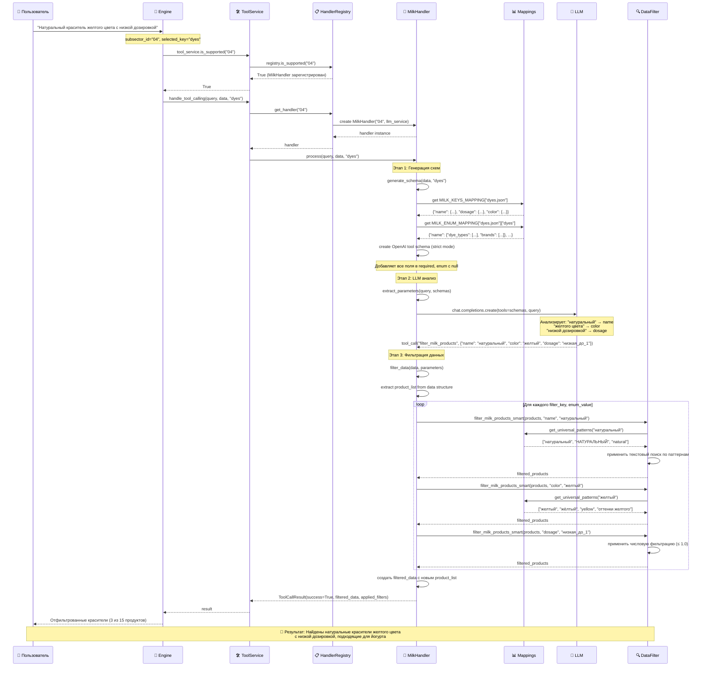

# Tool Calling Workflow для молочной отрасли

## Введение

Этот документ описывает полный цикл работы системы Tool Calling для молочной отрасли (subsector_id="04"). Workflow представляет собой интеллектуальную систему фильтрации продуктов, которая использует LLM для понимания критериев пользователя и применения их к структурированным данным.

## Контекст и предпосылки

**Что происходило до Tool Calling:**
1. Пользователь отправил запрос с `subsector_id="04"` (молочная отрасль)
2. Система определила релевантный JSON файл через семантический поиск
3. Выбран конкретный ключ данных (`selected_key`) - например, `"dyes"` для красителей
4. Данные загружены и готовы к обработке

**Пример исходного запроса:** 
*"Мне нужен натуральный краситель желтого цвета с низкой дозировкой для йогурта"*

## Полный пайплайн Tool Calling

### 🔍 Этап 1: Инициализация и проверка поддержки

**Код:** `engine.py:255`
```python
tool_service = ToolService(llm_service=client)
if tool_service.is_supported("04"):  # Проверяем молочную отрасль
```

**Что происходит:**
- `ToolService` обращается к `HandlerRegistry` для проверки поддержки
- В реестре находится зарегистрированный `MilkHandler` для subsector_id="04"
- ✅ Подтверждается: Tool Calling поддерживается для молочной отрасли

**Условия успеха:**
- MilkHandler зарегистрирован в registry
- LLM сервис доступен
- Переданы корректные данные

### 🏗️ Этап 2: Создание отраслевого обработчика

**Код:** `service.py:78`
```python
handler = self.registry.get_handler("04")  # Получаем MilkHandler
```

**Детали инициализации:**
- Создается экземпляр `MilkHandler("04", llm_service=client)`
- Инициализируется специализированный logger для молочной отрасли
- Загружаются mappings для структуры данных отрасли

### 🛠️ Этап 3: Генерация динамических tool схем

**Код:** `milk/service.py:132`
```python
schemas = handler.generate_schema(data, "dyes")  # Генерируем схемы для красителей
```

#### 3.1 Определение файла и структуры

**Процесс:**
1. `selected_key="dyes"` → определяется файл `"dyes.json"`
2. Из `KEY_TO_FILE_MAPPING` находится соответствие ключа файлу
3. Загружаются mappings структуры данных:

```python
# Из milk/mappings/keys.py
file_keys = MILK_KEYS_MAPPING["dyes.json"]
# Получаем описания полей:
{
    "name": {"description": "Название красителя", "filter_impact": "..."},
    "dosage": {"description": "Дозировка", "filter_impact": "..."},
    "color": {"description": "Цвет", "filter_impact": "..."}
}
```

#### 3.2 Загрузка enum значений

**Особенность milk industry - поддержка субключей:**
```python
# Из milk/mappings/enums.py
file_enum_mapping = MILK_ENUM_MAPPING.get("dyes.json", {})

# Для dyes.json структура:
"dyes.json": {
    "dyes": {  # Субключ!
        "name": {
            "dye_types": ["бета_каротин", "кармин", "куркумин", ...],
            "brands": ["ESCO", "WSC"],
            "natural_synthetic": ["натуральный", "синтетический"]
        },
        "dosage": {
            "dosage_levels": ["низкая_до_1", "средняя_1_10", "высокая_свыше_10"]
        },
        "color": {
            "color_families": ["желтый", "красный", "коричневый", "зеленый"]
        }
    }
}
```

**Ключевая логика - выбор enum для субключа:**
```python
if selected_key in file_enum_mapping:  # "dyes" найден в mapping
    file_enums = file_enum_mapping[selected_key]  # Берем enum'ы для "dyes"
else:
    file_enums = file_enum_mapping  # Общие enum'ы
```

#### 3.3 Создание OpenAI tool схемы

**Критические требования OpenAI strict mode:**
- Все поля должны быть в `required` массиве
- Поля могут быть null, поэтому `"type": ["string", "null"]`
- Enum должен содержать None для необязательных значений

```json
{
    "type": "function",
    "function": {
        "name": "filter_milk_products",
        "description": "Фильтрует продукты молочной отрасли из файла dyes.json по заданным критериям.",
        "parameters": {
            "type": "object",
            "properties": {
                "name": {
                    "type": ["string", "null"],
                    "description": "Название красителя. Позволяет искать по типу красителя и бренду",
                    "enum": ["бета_каротин", "кармин", "куркумин", "ESCO", "WSC", "натуральный", "синтетический", null]
                },
                "dosage": {
                    "type": ["string", "null"],
                    "description": "Дозировка красителя",
                    "enum": ["низкая_до_1", "средняя_1_10", "высокая_свыше_10", null]
                },
                "color": {
                    "type": ["string", "null"],
                    "description": "Цвет красителя",
                    "enum": ["желтый", "красный", "коричневый", "зеленый", null]
                }
            },
            "required": ["name", "dosage", "color"],  # ВСЕ поля обязательны для strict mode
            "additionalProperties": false
        },
        "strict": true
    }
}
```

### 🤖 Этап 4: LLM анализ и извлечение параметров

**Код:** `milk/service.py:218`
```python
parameters = handler.extract_parameters(query, schemas)
```

#### 4.1 Подготовка промпта

**Системный промпт:**
```
Ты - эксперт по анализу запросов пользователей для системы молочной промышленности.
Твоя задача - проанализировать запрос и выбрать подходящий инструмент для фильтрации продуктов.

ВАЖНО: Ты ДОЛЖЕН вызвать инструмент ТОЛЬКО ОДИН РАЗ. Никогда не делай несколько вызовов инструмента.
Используй предоставленный инструмент для точной фильтрации продуктов по критериям из запроса.
Если в запросе несколько критериев, выбери самый важный для начальной фильтрации.

Обязательно выбери только ОДНО значение для каждого параметра или null если параметр не нужен.
```

#### 4.2 Вызов LLM

**Запрос к LLM:**
```python
response = self.llm_service.chat.completions.create(
    model="devstral:24b-small-2505-q8_0",  # Из конфигурации TOOL_CALLING_MODEL
    messages=[
        {"role": "system", "content": system_prompt},
        {"role": "user", "content": "Мне нужен натуральный краситель желтого цвета с низкой дозировкой для йогурта"}
    ],
    tools=[наша_сгенерированная_схема],
    tool_choice="auto"
)
```

**Анализ LLM:**
- 🔍 "натуральный" → `name: "натуральный"`
- 🔍 "желтого цвета" → `color: "желтый"`
- 🔍 "низкой дозировкой" → `dosage: "низкая_до_1"`

#### 4.3 Парсинг ответа

**Результат от LLM:**
```json
{
    "tool_calls": [{
        "function": {
            "name": "filter_milk_products",
            "arguments": "{\"name\": \"натуральный\", \"color\": \"желтый\", \"dosage\": \"низкая_до_1\"}"
        }
    }]
}
```

**Обработка:**
```python
tool_params = json.loads(tool_call.function.arguments)
# Результат:
FilterParameters(
    tool_name="filter_milk_products",
    parameters={
        "name": "натуральный", 
        "color": "желтый", 
        "dosage": "низкая_до_1"
    }
)
```

### 🔧 Этап 5: Применение умной фильтрации

**Код:** `milk/service.py:300`
```python
filtered_data = handler.filter_data(data, parameters)
```

#### 5.1 Извлечение списка продуктов

**Проблема:** В молочной отрасли продукты могут лежать в разных структурах:
- Прямо в `data["product_list"]`
- В субключах `data["dyes"]["product_list"]`
- Как JSON строка, требующая парсинга

**Решение:**
```python
# Ищем product_list в корне данных
if "product_list" in data:
    if isinstance(data["product_list"], list):
        product_list = data["product_list"]
    elif isinstance(data["product_list"], str):
        # JSON строка - парсим
        product_list = json.loads(data["product_list"])
else:
    # Ищем в подключах
    for key, value in data.items():
        if isinstance(value, dict) and "product_list" in value:
            product_list = value["product_list"]
            break
```

#### 5.2 Последовательная фильтрация

**По каждому параметру:**
```python
filtered_products = product_list

for filter_key, enum_value in parameters.parameters.items():
    if enum_value and enum_value.strip():  # Проверяем, что значение не пустое
        logger.info(f"Применяем фильтр: {filter_key} = {enum_value}")
        
        # Умная фильтрация с использованием universal patterns
        filtered_products = filter_milk_products_smart(
            filtered_products, 
            filter_key,      # "name", "color", "dosage"
            enum_value       # "натуральный", "желтый", "низкая_до_1"
        )
        
        # Если продуктов не осталось - прерываем
        if not filtered_products:
            logger.warning(f"После фильтрации по {filter_key} не осталось продуктов")
            break
```

#### 5.3 Детали умной фильтрации

**Код:** `milk/data_filter.py`

**Для параметра `name: "натуральный"`:**
```python
# Ищем соответствующие паттерны
patterns = get_universal_patterns("натуральный")
# Возвращает: ["натуральный", "НАТУРАЛЬНЫЙ", "Натуральный", "natural"]

# Проверяем каждый продукт
for pattern in patterns:
    if pattern.lower() in product_text.lower():
        return True  # Продукт проходит фильтр
```

**Для параметра `color: "желтый"`:**
```python
patterns = get_universal_patterns("желтый")
# Возвращает: ["желтый", "жёлтый", "желтого", "yellow", "оттенки желтого"]
```

**Для параметра `dosage: "низкая_до_1"`:**
```python
# Специальная логика для дозировки
if field_key == "dosage" and enum_value == "низкая_до_1":
    # Ищем числовые значения в тексте
    dosage_match = re.search(r"(\d+(?:[.,]\d+)?)", product_text)
    if dosage_match:
        dosage_value = float(dosage_match.group(1).replace(',', '.'))
        return dosage_value <= 1.0  # Низкая дозировка
```

### 📊 Этап 6: Формирование результата

#### 6.1 Создание отфильтрованной структуры

```python
# Сохраняем исходную структуру, заменяем только product_list
filtered_data = data.copy()

if "product_list" in data:
    filtered_data["product_list"] = filtered_products
else:
    # Обновляем в подключах
    for key, value in filtered_data.items():
        if isinstance(value, dict) and "product_list" in value:
            filtered_data[key]["product_list"] = filtered_products
            break
```

#### 6.2 Логирование результатов

```python
logger.info(f"Итого отфильтровано продуктов: {len(filtered_products)} из {len(product_list)}")
# Пример: "Итого отфильтровано продуктов: 3 из 15"
```

### 🎯 Этап 7: Возврат результата

**Код:** `base/handler.py:102`
```python
return ToolCallResult(
    success=True,
    filtered_data=filtered_data,
    applied_filters={
        "name": "натуральный",
        "color": "желтый", 
        "dosage": "низкая_до_1"
    },
    metadata={
        "subsector_id": "04",
        "tool_name": "filter_milk_products",
        "selected_key": "dyes"
    }
)
```

## Особенности и нюансы молочной отрасли

### 🔑 1. Поддержка субключей (Subkeys)

**Проблема:** Некоторые JSON файлы имеют сложную структуру с субключами
```json
{
  "delar_flavor_collection.json": {
    "gastronomic_flavors": { "product_list": [...] },
    "sweet_flavors": { "product_list": [...] },
    "aromatic_emulsions": { "product_list": [...] }
  }
}
```

**Решение:** Enum mapping структурирован по субключам
```python
"delar_flavor_collection.json": {
    "gastronomic_flavors": {  # Специфичные enum'ы для этого субключа
        "name": {"meat_types": ["ветчина", "говядина"]},
        "flavor_profile": {"intensity_levels": ["легкий", "умеренный"]}
    },
    "sweet_flavors": {  # Другие enum'ы для этого субключа
        "name": {"fruit_types": ["абрикос", "ананас"]},
        "flavor_profile": {"sweetness_levels": ["слабая", "умеренная"]}
    }
}
```

### 🛡️ 2. OpenAI Strict Mode соответствие

**Требования:**
- Все поля в `required` массиве
- Поддержка null значений: `"type": ["string", "null"]`
- Все enum содержат null: `"enum": ["значение1", "значение2", null]`

### 🔍 3. Умная фильтрация с universal patterns

**Возможности:**
- Текстовый поиск с синонимами и вариациями
- Числовая фильтрация для дозировок и характеристик
- Regex паттерны для сложных критериев
- Fallback механизмы при отсутствии точных совпадений

### ⚡ 4. Graceful Fallback

**При любой ошибке:**
- Система возвращает исходные нефильтрованные данные
- Пайплайн продолжает работу
- Ошибка логируется, но не прерывает обработку запроса

## Граничные случаи и обработка ошибок

### 🚫 Случай 1: LLM не выбрал tool

**Поведение:**
```python
if not tool_calls:
    logger.warning("LLM не вернул tool call")
    return FilterParameters(
        tool_name="filter_milk_products",
        parameters={}  # Пустые параметры = нет фильтрации
    )
```

### 🚫 Случай 2: Некорректные параметры от LLM

**Защита:** Валидация на уровне enum - LLM может выбрать только допустимые значения

### 🚫 Случай 3: Не найдено продуктов после фильтрации

**Поведение:** Система возвращает пустой список, но не ошибку
```python
if not filtered_products:
    logger.warning("После фильтрации не осталось продуктов")
    # Но возвращаем корректную структуру с пустым списком
```

### 🚫 Случай 4: Ошибка в mappings или структуре данных

**Защита:** Fallback к стандартной обработке без фильтрации
```python
except Exception as e:
    logger.error(f"Ошибка в Tool Calling: {str(e)}")
    return ToolCallResult(
        success=False,
        filtered_data=data,  # Исходные данные
        applied_filters={},
        error_message=str(e),
        metadata={"fallback": True}
    )
```

---

## Sequence Diagram



---

**Итог:** Система Tool Calling для молочной отрасли представляет собой многоуровневую интеллектуальную фильтрацию, которая понимает естественный язык пользователя, преобразует его в структурированные критерии поиска и применяет их к сложным данным отрасли, обеспечивая при этом отказоустойчивость и точность результатов.